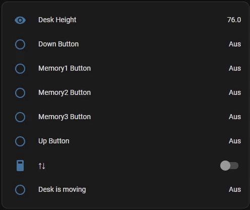

<a name="readme_top"></a>

# esphome_desktronic_custom_component

[![Contributors][contributors_shield]][contributors_url]
[![Forks][forks_shield]][forks_url]
[![Stargazers][stars_shield]][stars_url]
[![Issues][issues_shield]][issues_url]
<br>

## 📑 About the project

This is an esphome-custom-component for the [desktronic](https://desktronic.de/)-desk-controller (type of `jsdrive`). If you are using another desk-controller I recommend this [repository](https://github.com/ssieb/custom_components) and this [HomeAssistant-Forum-Thread](https://community.home-assistant.io/t/desky-standing-desk-esphome-works-with-desky-uplift-jiecang-assmann-others/383790). The making of this project (learnings, the hardware-structure, questions, software, etc.) can be viewed on this [HomeAssistant-Forum-Thread](https://community.home-assistant.io/t/turn-your-desktronic-standing-desk-into-a-smart-desk/530732).

I can recommend the [esphome8266 d1-mini](https://www.azdelivery.de/products/d1-mini). It has enough flash-memory and is easy to use.

<p align="right">(<a href="#readme_top">back to top</a>)</p>

## 📝 Disclaimer

I can not guarantee that it works with other desk-controllers. If you have a desk-controller from desktronic and it does not work, please open an [issue]([issues_url]). Then I will try to fix it as soon as possible.

<p align="right">(<a href="#readme_top">back to top</a>)</p>

## 💡 Usage (Example)

You can use the custom-component e. g. with [HomeAssistant](https://www.home-assistant.io/). Just add the following lines to your `configuration.yaml`.

### General

```yaml
external_components:
  - source:
      type: git
      url: https://github.com/MhouneyLH/esphome_custom_components
      ref: develop
    refresh: 4s
    components: [desktronic]

uart:
  - id: desk_bus
    tx_pin: 5
    rx_pin: 4
    baud_rate: 9600
  - id: remote_bus
    tx_pin: 3
    rx_pin: 1
    baud_rate: 9600

desktronic:
  id: my_desktronic
  desk_uart: desk_bus
  remote_uart: remote_bus
  height:
    name: Desk Height
  move_pin:
    number: 14
  up:
    name: Up Button
  down:
    name: Down Button
  memory1:
    name: Memory1 Button
  memory2:
    name: Memory2 Button
  memory3:
    name: Memory3 Button
```

### Move to a specific height

```yaml
switch:
  - id: move_switch
    name: ↑↓
    platform: gpio
    pin:
      number: 2
      inverted: true
    on_turn_on:
      then:
        - lambda: id(my_desktronic).move_to(80.0);
```

### Checking if the desk is moving

```yaml
binary_sensor:
  - id: is_moving_bsensor
    name: Desk is moving
    platform: template
    lambda: return id(my_desktronic).current_operation != desktronic::DESKTRONIC_OPERATION_IDLE;
```

### HomeAssistant UI

Just add the given (by the custom-component) entities to your HomeAssistant UI:



<p align="right">(<a href="#readme_top">back to top</a>)</p>

## 🔢 Getting started for contributing

1. Clone the repository

   ```sh
   git clone https://github.com/MhouneyLH/esphome_custom_components.git
   ```

2. Install the esphome-SourceCode from the [latest release](https://github.com/esphome/esphome/releases/).

3. Copy the directory `esphome` into the directory of the cloned repository.
   ```sh
   cp -r directory_of_esphome_release/esphome directory_of_cloned_repo
   ```

<p align="right">(<a href="#readme_top">back to top</a>)</p>

## 👨🏻‍💼 Contributing

Contributions are always welcome! Please look at following commit-conventions, while contributing: https://www.conventionalcommits.org/en/v1.0.0/#summary 😃

1. Fork the project.
2. Pick or create an [issue](https://github.com/MhouneyLH/esphome_custom_components/issues) you want to work on.
3. Create your Feature-Branch. (`git checkout -b feat/best_feature`)
4. Commit your changes. (`git commit -m 'feat: add some cool feature'`)
5. Push to the branch. (`git push origin feat/best_feature`)
6. Open a Pull-Request into the Develop-Branch.
<p align="right">(<a href="#readme_top">back to top</a>)</p>

<!-- Links and Images -->

[contributors_shield]: https://img.shields.io/github/contributors/MhouneyLH/esphome_custom_components.svg?style=for-the-badge
[contributors_url]: https://github.com/MhouneyLH/esphome_custom_components/graphs/contributors
[forks_shield]: https://img.shields.io/github/forks/MhouneyLH/esphome_custom_components.svg?style=for-the-badge
[forks_url]: https://github.com/MhouneyLH/esphome_custom_components/network/members
[stars_shield]: https://img.shields.io/github/stars/MhouneyLH/esphome_custom_components.svg?style=for-the-badge
[stars_url]: https://github.com/MhouneyLH/esphome_custom_components/stargazers
[issues_shield]: https://img.shields.io/github/issues/MhouneyLH/esphome_custom_components.svg?style=for-the-badge
[issues_url]: https://github.com/MhouneyLH/esphome_custom_components/issues
